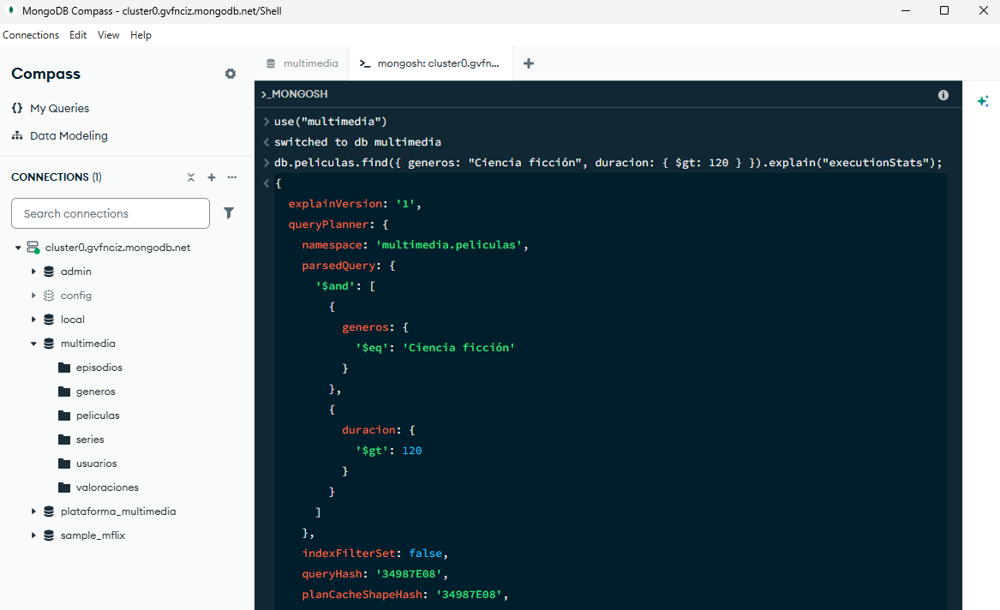

# Evidencias MongoDB

## 01 - Creación de Colecciones con Validación

Evidencia: Creando colecciones

## 02 - Inserción de Datos de Prueba

Evidencia: Usando base de datos Multimedia

Evidencia: Datos ya insertados en multimedia/valoraciones

Evidencia: Datos nuevos insertados en valoraciones

## 03 - Creación de Índices e Inspección del Plan

Evidencia: Agregando todos los indices

Evidencia: Resultado indice 1

Evidencia: Resultado indice 2

Evidencia: Resultado indice 3

Evidencia: Resultado indice 4

Evidencia: Comprobacion de indice usando consulta

## 04 - Consultas de Negocio, CRUD y Agregación Compleja

Evidencia: Insercion, actualizacion y borrado

Evidencia: Consulta 1

Evidencia: Consulta 2

Evidencia: Consulta 3

Evidencia: Consulta 4

Evidencia: Consulta 5

Evidencia: Consulta 6

Evidencia: Agregacion

## 05 - Copias de Seguridad y Seguridad

Evidencia: Usuarios y permisos

Evidencia: Borrado automático

