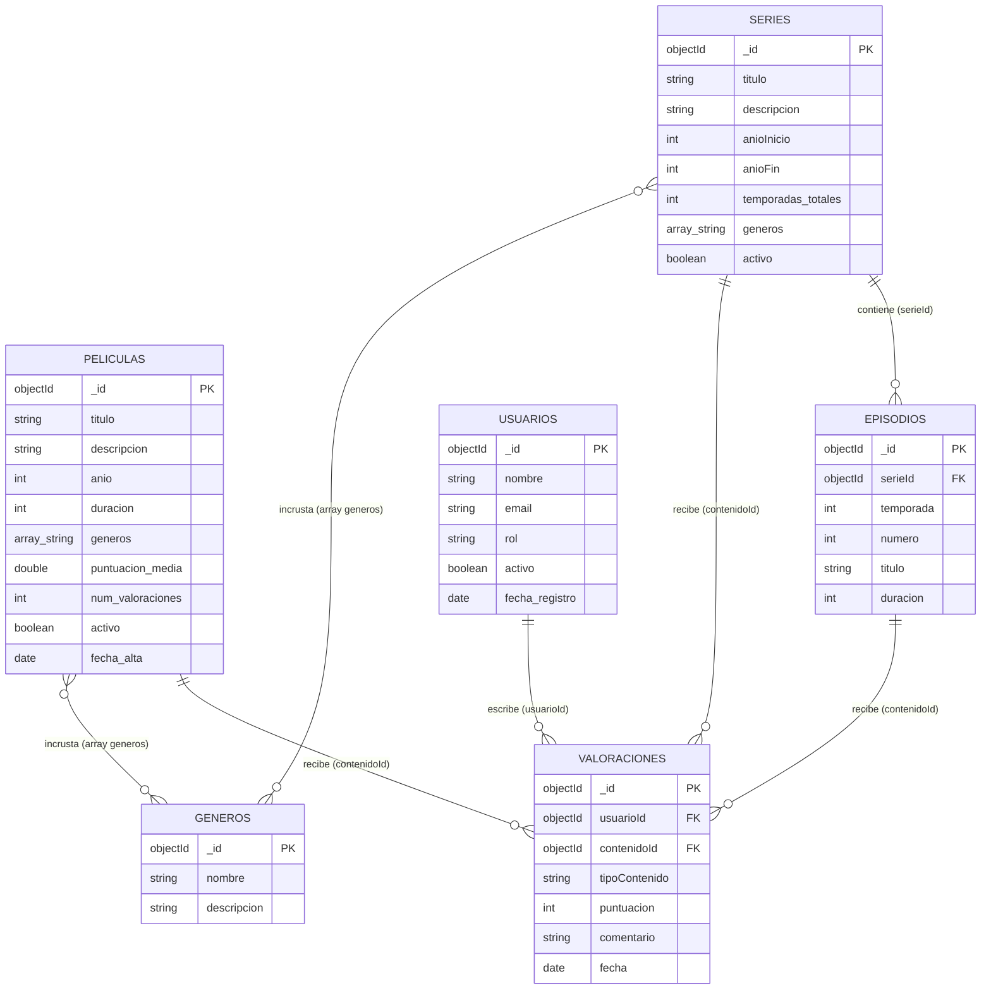

# Modelo de Datos y Colecciones

## 1. Diagrama de las colecciones

---

## 2. Colecciones y su propósito

1. **`generos`**: Guarda la lista de géneros (Ciencia ficción, Drama, Comedia, etc.).
2. **`peliculas`**: Guarda la información de cada película (título, año, duración, géneros, nota media).
3. **`series`**: Guarda las series con su título, años y número de temporadas.
4. **`episodios`**: Guarda los episodios de cada serie vinculados con `serieId`.
5. **`usuarios`**: Guarda los datos de los usuarios (nombre, email, rol).
6. **`valoraciones`**: Guarda las notas y comentarios que dejan los usuarios sobre las películas, series o episodios.

---

## 3. Ejemplo de documentos en JSON

- **Peliculas:** [JSON Peliculas](../datos/peliculas.json)
- **Series:** [JSON Series](../datos/series.json)
- **Episodios:** [JSON Episodios](../datos/episodios.json)
- **Usuarios:** [JSON Usuarios](../datos/usuarios.json)
- **Valoraciones:** [JSON Valoraciones](../datos/valoraciones.json)

---

## 4. Justificación de decisiones (Incrustar vs Referenciar)

### Incrustación
- **Géneros en películas y series:** He decidido añadir un array de texto con los nombres de los géneros (`["Ciencia ficción", "Acción"]`) dentro de cada película o serie.
  - _Razonamiento:_ Cada película solo tiene 1, 2 o 3 géneros. Al ponerlos dentro del documento se leen directamente sin tener que hacer un `$lookup` cada vez que mostramos el catálogo.

### Referencia
- **Valoraciones separadas en su propia colección:** He decidido guardar las valoraciones en una colección aparte referenciando `usuarioId` y `contenidoId`.
  - _Razonamiento:_ Una película popular puede tener miles de valoraciones. Si las incrustáramos dentro de la película, el documento crecería demasiado y superaría el límite de 16 MB de MongoDB.
- **Episodios en colección separada:** Se guardan con una referencia a `serieId` para no cargar todos los episodios cuando solo queremos ver la información general de la serie.

---

## 5. Estrategia de IDs, Fechas y Estados

- **IDs:** Uso de `ObjectId` por defecto de MongoDB.
- **Fechas:** Uso de objetos de fecha nativos (`Date`) para poder filtrar por años o hacer ordenaciones.
- **Borrado lógico:** Uso del campo `activo: true/false`. En vez de borrar documentos con `deleteOne`, los marco como `activo: false` para no perder el historial.

---

## 6. Límites del modelo

- **Límite de 16 MB:** Controlado al separar las valoraciones y episodios en colecciones independientes.
- **Campos denormalizados:** Guardar `puntuacion_media` en la película ayuda a leer rápido, pero hay que acordarse de actualizarla cuando alguien añade una valoración.
